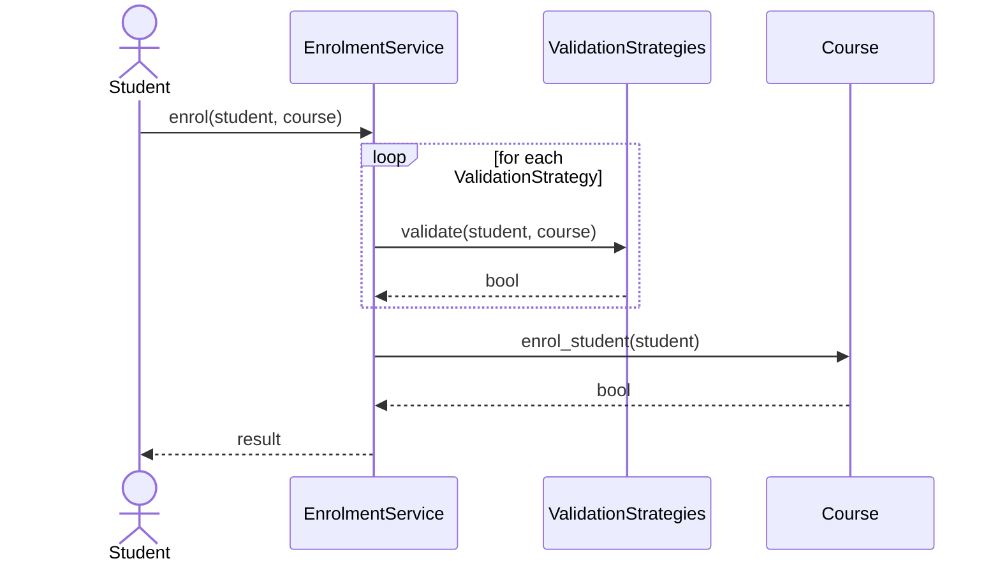
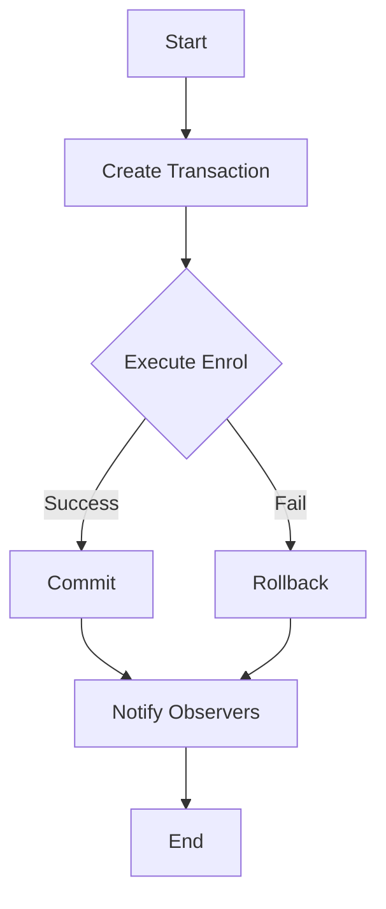
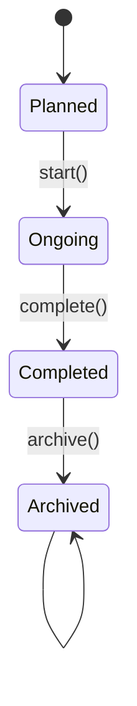

# NexusEnroll – Architectural and Design Documentation

Date: 2025-09-03

## Overview

This document explains the system architecture, design decisions, UML diagrams, and how object-oriented design principles and design patterns are applied to the NexusEnroll proof-of-concept (PoC) implementation. The PoC focuses on the business tier per the assignment brief. A simple runner (`main.py`) demonstrates student, faculty, and administrator use cases.

## Architectural choice and justification

- Selected pattern: 3‑Tier Architecture
  - Presentation: CLI demo in `main.py` (UI is optional per brief).
  - Business/Domain: Modules under `core/`, `enrolment/`, `faculty/`, `admin/`, `schedule/`, `shared/` implement domain logic and policies.
  - Data/Integration: In this PoC, persistence and external services are stubbed; interfaces and adapters demonstrate how integrations would be introduced.

Why 3‑Tier fits now
- Maintainability: Clear separation of concerns allows business logic to evolve independently from UI and data concerns.
- Scalability: Stateless business services can be horizontally scaled; the data tier can be optimized independently later.
- Extensibility: Clean boundaries let us add APIs (REST/gRPC) for SPA/mobile without changing core logic.
- Incremental modernization: 3‑tier provides a stepping stone. Services can be later extracted into microservices (e.g., Enrolment, Catalogue, Grades) when needed.

Future evolution
- If/when organizational scale demands, the business tier can be split into microservices. The existing adapters and pattern boundaries reduce coupling and ease extraction.

## Architectural diagram

```mermaid
flowchart LR
  subgraph Presentation (CLI / Future SPA)
    MAIN[main.py]
  end

  subgraph Business / Domain
    CORE[core: Course, Catalogue, Factory]
    ENR[enrolment: Service (Strategy+Command)]
    SCH[schedule: Schedule, State, Progress]
    FAC[faculty: Grades(State+Command), Roster(Facade+Iterator), Requests(CoR+Decorator)]
    ADM[admin: Builder, Reports(Template), Adapters]
    SHD[shared: Notifications(Observer), Transactions]
  end

  subgraph Data / Integration (stubs)
    DB[(Persistence APIs – future)]
    EXT[(Email/SMS – via NotificationService)]
  end

  MAIN --> ENR
  MAIN --> FAC
  MAIN --> ADM
  ENR -- uses --> CORE
  ENR -- notifies --> SCH
  FAC -- reads --> CORE
  FAC -- notifies --> SHD
  ADM -- generates --> SHD
  SCH -- publishes --> SHD
  SHD -- adapter --> EXT
  Business --- DB
```

## Patterns used and rationale

- Strategy: `enrolment.validation_strategies` for pluggable enrolment validation (capacity, prerequisites, time conflicts).
- Command: `enrolment.enrolment_service` encapsulates enrol/drop; `faculty.grades.SubmitGradeCommand` encapsulates grade submission.
- Factory Method: `core.catalogue.ConcreteCourseFactory` creates different course types.
- Observer: `schedule.schedule.ScheduleObserver` and `shared.notifications` to decouple event notifications.
- State: `schedule.course_state.CourseContext` (course lifecycle) and `faculty.grades.Grade` states.
- Builder: `admin.builder` program construction via director.
- Template Method: `admin.reports.ReportGenerator` skeleton for reports.
- Adapter: `admin.adapters` output format conversions (CSV/JSON/PDF placeholder).
- Facade + Iterator: `faculty.roster` for simple roster viewing.
- Chain of Responsibility + Decorator: `faculty.course_requests` approval flow with logging.
- Singleton: `admin.management.AdminManager` central admin control sample.
- Transaction: `shared.transactions` ensures all‑or‑nothing operations.

## Software design principles (examples)

- Encapsulation: `core.course.Course` hides enrol/drop rules behind methods; direct list mutations are avoided.
- Program to an interface: Validation via `ValidationStrategy` ABC; reports via `ReportGenerator` ABC.
- Composition over inheritance: Strategies, commands, and decorators compose behavior rather than subclassing logic.
- SOLID examples:
  - SRP: `EnrolmentService` only coordinates enrol/drop and delegates validation to strategies.
  - OCP: Add a new validation by subclassing `ValidationStrategy` without changing `EnrolmentService`.
  - LSP: `LectureCourse` and `LabCourse` can be used wherever `Course` is expected.
  - ISP: Separate small interfaces (strategies, adapters) avoid fat interfaces.
  - DIP: `EnrolmentService` depends on abstractions (`ValidationStrategy`) not concrete classes.

## Core UML diagrams

### Class diagram (key classes and patterns)

```mermaid
classDiagram
  class Course {
    -id: str
    -name: str
    -instructor: str
    -capacity: int
    -prerequisites: list
    -schedule
    -enrolled_students: list
    +enrol_student(student) bool
    +drop_student(student) bool
  }

  class CourseFactory {
    <<abstract>>
    +create_course(type, **kwargs) Course
  }
  class LectureCourse
  class LabCourse
  CourseFactory <|.. ConcreteCourseFactory
  Course <|-- LectureCourse
  Course <|-- LabCourse

  class EnrolmentService {
    -validation_strategies: list~ValidationStrategy~
    +enrol(student, course) bool
    +drop(student, course) bool
  }
  class ValidationStrategy { <<abstract>> +validate(student, course) bool }
  class CapacityValidation
  class PrerequisiteValidation
  class ScheduleConflictValidation
  ValidationStrategy <|.. CapacityValidation
  ValidationStrategy <|.. PrerequisiteValidation
  ValidationStrategy <|.. ScheduleConflictValidation

  class Command { <<abstract>> +execute() +undo() }
  class EnrolCommand
  class DropCommand
  Command <|.. EnrolCommand
  Command <|.. DropCommand

  class Grade {
    +submit()
    +undo()
    -state: GradeState
  }
  class GradeState { <<abstract>> +submit(grade) +undo(grade) }
  class DraftState
  class PendingState
  class SubmittedState
  GradeState <|.. DraftState
  GradeState <|.. PendingState
  GradeState <|.. SubmittedState
  Grade --> GradeState

  class ProgramBuilder { <<abstract>> }
  class ConcreteProgramBuilder
  class ProgramDirector
  ProgramBuilder <|.. ConcreteProgramBuilder
  ProgramDirector --> ProgramBuilder

  class ReportGenerator { <<abstract>> +generate() }
  class EnrollmentReport
  ReportGenerator <|.. EnrollmentReport
  class ReportAdapter { <<abstract>> +convert(report) }
  class CSVAdapter
  class JSONAdapter
  ReportAdapter <|.. CSVAdapter
  ReportAdapter <|.. JSONAdapter

  class NotificationService { +subscribe(obs) +notify(event, data) }
  class Observer { <<abstract>> +update(event, data) }
  class StudentNotifier
  Observer <|.. StudentNotifier
  NotificationService --> Observer

  class RosterFacade { +view_roster() }
  class RosterIterator { +__next__() }
```



### Sequence diagram – enrolment



### Activity diagram – enrol/drop transaction



### State diagram – course lifecycle



## Mapping to requirements

- Student module: Catalogue browse (factory/catalogue), enrol/drop with validation (strategy+command), schedule updates (observer), progress tracking.
- Faculty module: Roster viewing (facade+iterator), grade submission lifecycle (state+command), course requests approval (chain+decorator).
- Administrator module: Course/program management (builder), overrides, reporting (template+adapter).
- System‑wide: Notifications (observer), Transaction management (transaction base + enrolment transaction).

## How to run the PoC

1) Use Python 3.11+. From repo root, run the demo:
   - Windows PowerShell: python .\main.py
2) The script prints a short walk‑through covering the three modules and patterns.

## Notes

- This PoC focuses on the business tier. Persistence and real messaging are stubbed and can be added behind interfaces introduced here.
- Diagrams use Mermaid for portability in Markdown‑based submissions.
